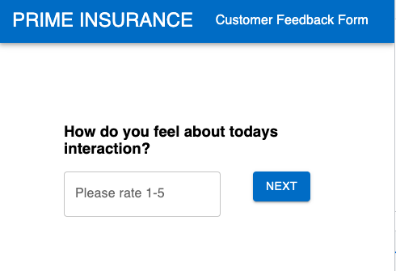
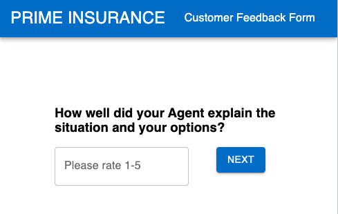
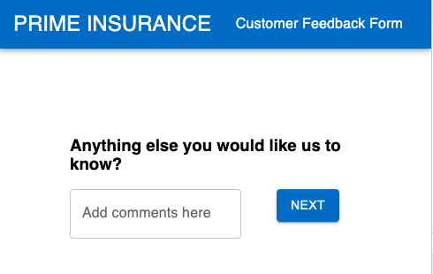
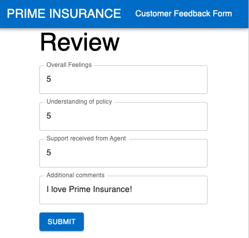
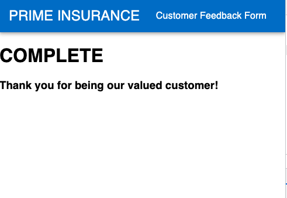

# Project Name
Insurance Agency Customer Feedback Form

## Description
In this project, I created a customer feedback form for an insurance agency.
The feedback for asks 4 questions about the customers recent interaction with thier agent.
Each question asks for a rating of 1-5, with 5 meaning they had an outstanding experience.
After the questions are cpmplete, the user will see a review page displaying the respective input.
Last, the customer will see a thank you page.

Upon submit, all data is stored in a database for future reference.

## Preview

## Installation & Setup
Clone down this repository. You will need node and npm installed globally on your machine.
Create a database with the name prime_feedback.
Create a table using the instructions in data.sql.
In your editor of choice, run npm install in your terminal.
Run npm run server in your terminal.
In a new terminal window, run npm run client.

## Technologies used
Javascript
React
Redux
Axios
MaterialUI
PostgreSQL

## special thanks
Thank you to Prime Digital Academy, and my instructor Chris Black.

